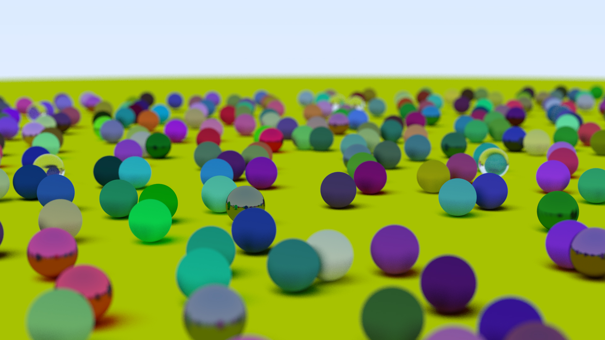
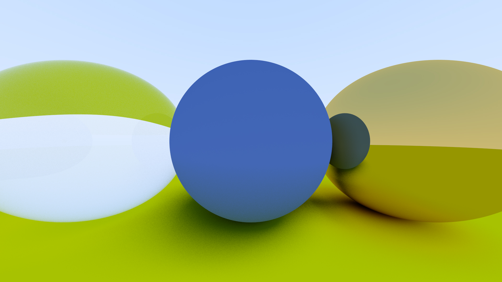

# weekend raytracer

a very cursed zig implementation of [Ray Tracing in One Weekend](https://raytracing.github.io/books/RayTracingInOneWeekend.html).

it works, but zig doesn't support operator overloading so it might be hard to read (i've commented the equations in the really hard to read spots). it also ships with a polymorphic Vec3 struct which is completely unnecessary but was fun to write.

it also has a wrapper over stb_image/stb_image_write, but it only supports writing jpg images atm.

## sample output

